# Releasing `better-env`

This document is the authoritative guide for publishing `better-env` to npm. It covers the threat model, the one-time setup of the secure publishing pipeline, the per-release runbook, and the break-glass procedure if something goes wrong.

`better-env` does **not** support publishing from a maintainer's laptop. Every published version must pass through the GitHub Actions release workflow with OIDC trusted publishing, provenance, and a manual stage-approval step on npm.

## Why

Recent npm supply-chain incidents (Shai-Hulud, repeated maintainer-account takeovers, leaked CI tokens) almost all stem from one root cause: **long-lived npm publish tokens stored somewhere**. The pipeline below removes that root cause and adds two independent gates between "commit on `main`" and "live on the registry":

1. **Click "Publish release" on GitHub** — confirms the commit and version are intentional.
2. **`npm stage approve better-env` with WebAuthn** — confirms the actual tarball CI produced is what should go live.

Either gate alone is enough to stop a bad publish.

## Pipeline architecture

```mermaid
flowchart LR
    devCommit[Commit on main] --> ghRelease["Maintainer publishes GitHub Release vX.Y.Z"]
    ghRelease --> tagProt["Tag-protection rule allows tag"]
    tagProt --> ciRun["release.yml runs on GitHub-hosted runner"]
    ciRun --> oidc["GitHub mints OIDC token (id-token: write)"]
    oidc --> npmStage["npm stage publish --provenance"]
    npmStage --> staging["Package sits in npm staging area"]
    staging --> review["Maintainer: npm stage view better-env"]
    review --> approve["npm stage approve better-env (WebAuthn)"]
    approve --> live["Live on registry.npmjs.org with provenance"]
```



### Defensive primitives in play

- **npm Trusted Publishing (OIDC)** — npm only accepts a publish from `release.yml` in `neon-solutions/better-env`, authenticated by a short-lived OIDC token GitHub mints per run. No long-lived tokens exist anywhere.
- **npm provenance attestation** — every published version is cryptographically signed via Sigstore and bound to the exact GitHub commit and workflow that built it. Anyone can run `npm audit signatures` to verify.
- **"Require 2FA and disallow tokens"** on the package — registry-side switch that refuses any publish that is not OIDC + 2FA, even if an attacker steals a legacy token.
- **npm staged publishing** — `release.yml` runs `npm stage publish`, not `npm publish`. The tarball lands in a staging area; the maintainer inspects it and approves with WebAuthn before it goes live.
- **GitHub tag-protection rules** — only maintainers can create the `v*` tag that ships with a Release.
- **WebAuthn/passkey 2FA** on the npm account — phishing-resistant (TOTP is being phased out by npm).
- **SHA-pinned third-party Actions** in `release.yml` — neutralises Action-side compromises (a malicious force-push to a tag cannot move the pin).

## Setup state

The pipeline is live. `v0.3.2` was published through it on 2026-05-24, which is itself the
end-to-end proof that trusted publishing, staged publish, and provenance all work.

### GitHub repository (`neon-solutions/better-env`)

Verified against the API on 2026-08-10:

| What                           | State                                                                                                                                        |
| ------------------------------ | -------------------------------------------------------------------------------------------------------------------------------------------- |
| Tag protection                 | Ruleset "release tags", active, targets `refs/tags/v*`, restricts creation, update, deletion                                                 |
| `main` protection              | Ruleset "main", active: pull request with 1 approving review, signed commits required, no deletion, no force-push. Repo admins keep a bypass |
| Default workflow permissions   | `read` — `release.yml` still gets `id-token: write` because a job may request more than the default, just not more than the repo allows      |
| Actions creating/approving PRs | Off                                                                                                                                          |

`main` is protected by a **repo ruleset**, not classic branch protection, so
`repos/.../branches/main/protection` returns 404. That is not an unprotected branch — read
`repos/.../rulesets` instead.

### npm

These live in the npm web UI and cannot be read back from here. Re-confirm them on
`https://www.npmjs.com/package/better-env/access` if a publish ever behaves unexpectedly:

- **Trusted Publisher** bound to `neon-solutions/better-env` and workflow `release.yml`, with
  **`npm stage publish` only** selected and `npm publish` left unchecked. This is the single
  most important switch in the pipeline: it forces every CI publish through the stage-approve
  gate, so even a compromised `release.yml` cannot push live without a WebAuthn approval.
- **Publishing access** set to "Require two-factor authentication and disallow tokens".
- WebAuthn/passkey 2FA on the maintainer account, and no surviving publish tokens with write
  access to `better-env`.

## Per-release runbook

Follow this every time you ship a new version. The whole sequence is typically 5-10 minutes of attended work; everything in step 5 is automated.

1. **Sync `main`.**

   ```bash
   git checkout main && git pull
   ```

2. **Make sure everything you want shipped is on `main`** and the existing CI is green for that commit. All feature work lands via normal PRs first.

3. **Bump the version and changelog locally.**
   - Edit `package.json` `version` according to semver (see "Versioning" below).
   - Add an entry at the top of `CHANGELOG.md` matching the existing tone.
   - Commit as `chore: release vX.Y.Z` and push to `main`.

4. **Draft and publish the GitHub Release.**
   - On `https://github.com/neon-solutions/better-env/releases`, click **Draft a new release**.
   - "Choose a tag" -> type `vX.Y.Z` (must match `package.json#version`; the workflow will fail fast if they disagree).
   - Target: `main`.
   - Title: `vX.Y.Z`.
   - Body: paste the CHANGELOG entry.
   - Click **Publish release**. This creates the tag and fires `release.yml`.

5. **Wait for CI.** `release.yml` runs typecheck, tests, build, then `npm stage publish --provenance`. Watch it on the Actions tab. On green, the package is in npm staging, **not** live.

6. **Review the staged tarball.**

   ```bash
   npm stage list                 # shows pending staged versions for packages you maintain
   npm stage view better-env      # inspect the staged release for better-env
   ```

   Verify:
   - The version number matches what you intended.
   - The file list is exactly `dist/`, `skills/`, and `README.md` (whatever `package.json#files` whitelists), with no surprise files.
   - The shasum matches the workflow run's published artifact.
   - The provenance attestation references the correct commit SHA.

7. **Approve.**

   ```bash
   npm stage approve better-env   # prompts for WebAuthn
   ```

   The package goes live.

8. **Verify it landed correctly.**

   ```bash
   npm view better-env version
   npm view better-env dist-tags
   npm audit signatures better-env@X.Y.Z
   ```

9. **If anything looked wrong at step 6, reject instead of approving.**

   ```bash
   npm stage reject better-env
   ```

   Nothing is published. Investigate, fix on a branch, cut a new patch release.

### Versioning

`better-env` follows semver. As a rough guide:

- **patch** — bug fixes, adapter internal tweaks, internal-only changes that do not alter behaviour.
- **minor** — new features, new adapter support, new CLI flags. Backward-compatible.
- **major** — breaking changes to CLI flags, adapter contracts, config schema, or runtime API. Add a migration note to the CHANGELOG.

## Break-glass procedures

### Stolen / lost passkey suspected

1. On a separate trusted device, sign in to npmjs.com.
2. Remove the compromised device from `https://www.npmjs.com/settings/<your-username>/2fa`.
3. Enroll a fresh passkey.
4. No tokens need rotating; trusted publishing keeps working unchanged.

### Suspected repository compromise (malicious PR, force-push, etc.)

1. Disable the trusted-publisher binding on `https://www.npmjs.com/package/better-env/access` to halt all CI publishes immediately.
2. Audit `main`, the `release.yml` workflow, and the `v*` tag history.
3. Once clean, re-enable the trusted publisher and ship a clean release.

Note: even without step 1, an attacker cannot directly publish from a PR branch or a fork because OIDC only accepts publishes from `release.yml` on `neon-solutions/better-env`'s default branch flow. Tag protection prevents them from triggering the real `release.yml`. Step 1 is belt and braces.

### Emergency publish when CI is broken

By design you cannot publish from a laptop. The escape hatch:

1. On npmjs.com, **Publishing access** -> flip **"Require two-factor authentication and disallow tokens"** off temporarily.
2. Create a granular access token with a 7-day expiry scoped to `better-env` only.
3. Publish locally with that token.
4. Revoke the token immediately.
5. Flip "Require 2FA and disallow tokens" back on.
6. Open an issue describing what broke in CI and fix it before the next release.

If/when there is a second maintainer, this escape hatch must require their explicit sign-off before being used.

## Out of scope (intentional)

- **Dependency pinning / Dependabot / lockfile-lint.** Complementary supply-chain hardening; not in this doc.
- **Reproducible builds.** `tsup` output is not byte-reproducible across Node versions. The provenance attestation proves "this exact tarball came from this exact commit via this exact workflow," which is the security property that matters.
- **Sigstore verification of installed dependencies (`npm audit signatures` in CI).** Worth adding as a follow-up; not required for the publish-side hardening this document covers.
